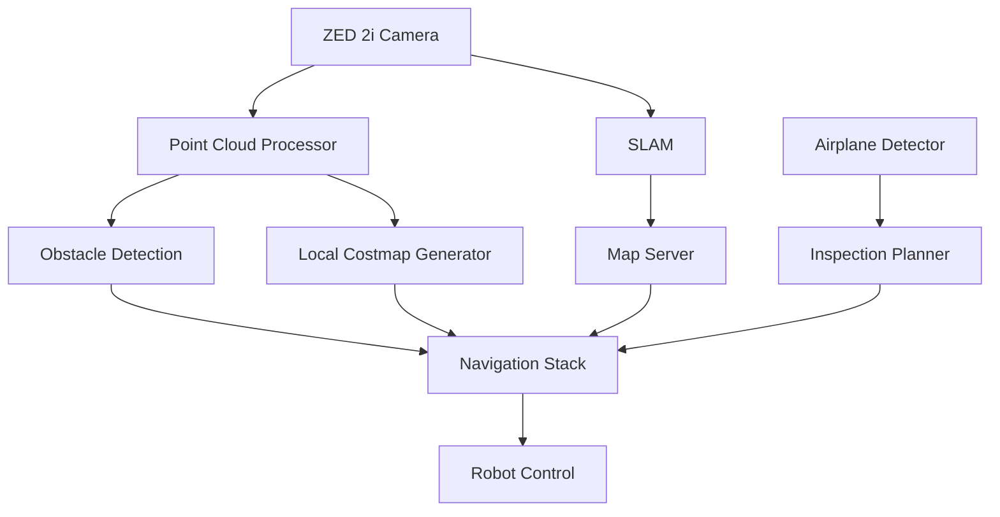

# Xavier Robotics - Autonomous Airplane Inspection System

 <!-- You may want to add a logo image -->

## Project Overview

The Xavier Robotics Autonomous Airplane Inspection System is a robotic solution designed to autonomously navigate around aircraft and perform visual inspections. This system combines advanced computer vision, simultaneous localization and mapping (SLAM), and autonomous navigation to create an efficient inspection platform that can operate in complex environments.

The robot uses a ZED 2i stereo camera for visual perception, builds real-time maps of its environment, autonomously navigates around aircraft while avoiding obstacles, and conducts systematic inspections according to configurable patterns.

## Key Features

- **Autonomous Navigation**: Uses ROS 2 Nav2 for waypoint navigation around aircraft
- **SLAM Mapping**: Real-time environment mapping using ZED 2i depth data
- **Obstacle Detection and Avoidance**: Processes point cloud data to identify and avoid obstacles
- **Computer Vision**: Detects and localizes aircraft in the environment
- **Dynamic Path Planning**: Generates inspection paths optimized for coverage and efficiency
- **2D Costmap Generation**: Creates traversability maps for navigation planning
- **Inspection Status Monitoring**: Tracks inspection progress and completion

## System Architecture

The system consists of several ROS 2 packages, each responsible for different aspects of the inspection system:

```
xavier_robotics/
├── robot_description/      # URDF models and robot description
├── robot_interfaces/       # Custom messages and service definitions
├── autonomous_nav/         # Navigation, SLAM, and obstacle avoidance
├── airplane_detection/     # Computer vision for airplane detection
├── inspection_planner/     # Inspection path planning algorithms
├── xavier_robotics/        # Meta-package and system integration
└── zed_ros2/               # ZED camera drivers and utilities
```

### Component Interactions



## System Requirements

### Hardware Requirements

- **Robot Platform**: Tracked robot (1070mm × 820mm × 680mm)
- **Sensors**: ZED 2i stereo camera
- **Computing**: NVIDIA Jetson Orin NX or equivalent (recommended)
- **Power**: On-board battery system with sufficient runtime

### Software Requirements

- **Operating System**: Ubuntu 22.04 (Jammy Jellyfish)
- **ROS 2**: Humble Hawksbill
- **ZED SDK**: Latest version compatible with ROS 2 Humble
- **CUDA**: For ZED SDK and computer vision processing
- **Dependencies**:
  - Navigation2 (Nav2)
  - SLAM Toolbox
  - PyTorch (for airplane detection)
  - OpenCV
  - PCL (Point Cloud Library)

## Installation

### 1. Prerequisites

Install ROS 2 Humble following the [official installation guide](https://docs.ros.org/en/humble/Installation.html).

Install the ZED SDK:
```bash
wget -O ZED_SDK_Linux.run https://download.stereolabs.com/zedsdk/latest
chmod +x ZED_SDK_Linux.run
./ZED_SDK_Linux.run
```

### 2. Clone the Repository

```bash
mkdir -p ~/xavier_robotics/src
cd ~/xavier_robotics/src
git clone https://github.com/your-organization/xavier_robotics.git .
```

### 3. Install Dependencies

```bash
cd ~/xavier_robotics
sudo apt update
rosdep update
rosdep install --from-paths src --ignore-src -r -y
```

### 4. Build the Project

```bash
cd ~/xavier_robotics
colcon build --symlink-install
source install/setup.bash
```

## Usage Instructions

### Initial Setup and Calibration

1. **Connect the ZED 2i Camera**:
   ```bash
   # Verify camera connection
   ros2 run autonomous_nav zed_camera_check.py
   ```

2. **Calibrate the System**:
   ```bash
   # Run camera calibration if needed
   ros2 run camera_calibration cameracalibrator --size 8x6 --square 0.108 image:=/zed2i/zed_node/rgb/image_rect_color
   ```

### Mapping Mode

Generate a map of the environment before inspection:

```bash
# Launch SLAM with the ZED camera
ros2 launch autonomous_nav zed2i_slam.launch.py

# In a new terminal, control the robot to move around the environment
ros2 run teleop_twist_keyboard teleop_twist_keyboard cmd_vel:=/cmd_vel

# Save the generated map when complete
ros2 service call /map_saver/save_map nav2_msgs/srv/SaveMap "map_url: 'map'"
```

### Autonomous Inspection Mode

There are two ways to run the inspection system:

#### Option 1: Using the Launch Script (Recommended)

```bash
# Navigate to project root
cd ~/xavier_robotics

# Run the launcher script (handles environment setup automatically)
./src/xavier_robotics/scripts/launch_inspection.sh
```

#### Option 2: Manual Launch

```bash
# Navigate to project root
cd ~/xavier_robotics

# Source ROS 2 and project setup
. /opt/ros/humble/setup.bash
. install/setup.bash

# Launch the full inspection system
ros2 launch xavier_robotics autonomous_airplane_inspection.launch.py
```

### Using Costmap Generation

The system generates 2D costmaps for navigation:

```bash
# Check and display generated costmaps
./src/xavier_robotics/scripts/check_costmaps.sh

# Run costmap-only mode for testing
ros2 launch xavier_robotics real_costmap_inspection.launch.py
```

### Monitoring the System

Several tools are available for system monitoring:

```bash
# Launch RViz for visualization
ros2 launch robot_description display.launch.py

# Monitor inspection status
ros2 topic echo /inspection_status

# Check ZED camera status
ros2 run autonomous_nav zed_camera_monitor.py
```

## Package Details

### robot_description

Contains the URDF description of the robot platform, including the ZED 2i camera mount and other components. The package defines the robot's physical properties, joint limits, and sensor placements.

Key files:
- `urdf/robot.urdf.xacro`: Main robot description
- `urdf/robot_base.xacro`: Base platform description
- `urdf/zed2i.xacro`: ZED 2i camera model
- `launch/display.launch.py`: Visualize the robot model in RViz

### robot_interfaces

Defines custom messages and services used by the system:

- `msg/AirplaneDetection.msg`: Message format for detected airplanes
- `msg/InspectionStatus.msg`: Status updates during inspection
- `srv/SetInspectionTarget.srv`: Service to set inspection targets

### autonomous_nav

Handles all navigation-related functionality:

- SLAM for environment mapping
- Path planning and waypoint navigation
- Obstacle detection and avoidance
- Point cloud processing for costmap generation
- Integration with the ZED camera for depth perception

Key components:
- `zed_point_cloud_processor.py`: Processes depth data from the ZED camera
- `obstacle_detection.py`: Identifies obstacles from point cloud data
- `path_planner.py`: Plans navigation paths around obstacles
- `waypoint_navigator.py`: Navigates through planned waypoints
- `costmap_saver.py`: Saves generated costmaps for future use

### airplane_detection

Implements computer vision algorithms to detect and localize airplanes:

- Uses deep learning models for object detection
- Publishes detected airplane poses and dimensions
- Provides visualization tools for debugging

Key components:
- `detector.py`: Main detection algorithm
- `airplane_detector_node.py`: ROS 2 node for detection
- `detection_visualizer.py`: Visualization of detection results

### inspection_planner

Plans efficient inspection paths around detected airplanes:

- Generates coverage patterns for different aircraft types
- Adapts inspection plans based on environment constraints
- Monitors inspection progress and completion

Key components:
- `inspection_patterns.py`: Different inspection path patterns
- `inspection_planner_node.py`: ROS 2 node for planning
- `inspection_visualizer.py`: Visualization of inspection paths

### xavier_robotics

Top-level package for system integration:

- Launch files for the complete system
- Configuration and parameter management
- Utility scripts for system operation

Key files:
- `launch/autonomous_airplane_inspection.launch.py`: Main launch file
- `scripts/launch_inspection.sh`: Convenience script for launching
- `scripts/check_costmaps.sh`: Utility for costmap management

## Configuration

The system behavior can be customized through various configuration files:

### Navigation Parameters

```bash
# Edit navigation parameters
nano src/autonomous_nav/config/nav2_params.yaml
```

Key parameters:
- `controller_server.ros__parameters.max_vel_x`: Maximum forward velocity
- `controller_server.ros__parameters.max_vel_theta`: Maximum rotational velocity
- `planner_server.ros__parameters.GridBased.tolerance`: Goal reaching tolerance

### SLAM Parameters

```bash
# Edit SLAM parameters
nano src/autonomous_nav/config/slam_params.yaml
```

Key parameters:
- `slam_toolbox.ros__parameters.resolution`: Map resolution
- `slam_toolbox.ros__parameters.optimize_slam`: Enable/disable online optimization

### Detection Parameters

```bash
# Edit airplane detection parameters
nano src/airplane_detection/config/detection_params.yaml
```

Key parameters:
- `model_path`: Path to the detection model
- `confidence_threshold`: Minimum confidence for detections
- `detection_frequency`: How often to run detection (Hz)

### Inspection Parameters

```bash
# Edit inspection parameters
nano src/inspection_planner/config/inspection_params.yaml
```

Key parameters:
- `inspection_distance`: Distance to maintain from the aircraft
- `inspection_height`: Height for inspection passes
- `coverage_overlap`: Overlap between inspection passes

## Troubleshooting

### ZED Camera Issues

If the ZED camera is not detected:

```bash
# Check if the camera is connected
lsusb | grep Stereolabs

# Check ZED SDK installation
/usr/local/zed/tools/ZED_Diagnostic

# Verify camera node is running
ros2 topic list | grep zed
```

### Navigation Issues

If the robot fails to navigate properly:

```bash
# Check TF tree for missing transforms
ros2 run tf2_tools view_frames

# Verify costmap generation
ros2 topic echo /local_costmap/costmap --once

# Check if navigation stack is running
ros2 node list | grep nav2
```

Common issues and solutions:

1. **TF Tree Issues**:
   - Ensure the static map→odom transform is published
   - Check that the static_odom_publisher is running

2. **Behavior Tree Navigator Error**:
   - Verify behavior tree XML path is correct
   - Check for missing navigation files

3. **RViz Display Issues**:
   - Set DISPLAY environment variable correctly
   - Use dbus-launch for proper X11 authentication

4. **Costmap Generation Issues**:
   - Check if point cloud data is being published
   - Verify local_costmap_generator is running
   - Check permissions on map save directory

## Development

### Adding New Features

1. **Fork the repository**
2. **Create a new branch**:
   ```bash
   git checkout -b feature/your-feature-name
   ```
3. **Make your changes and test thoroughly**
4. **Submit a pull request**

### Coding Standards

- Follow ROS 2 coding standards
- Use Python type hints for better code readability
- Document all public interfaces with docstrings
- Add unit tests for new functionality

### Building Documentation

```bash
# Generate documentation
cd ~/xavier_robotics
colcon build --packages-select xavier_robotics --cmake-target doc
```

## Contributing

We welcome contributions to improve the Xavier Robotics Autonomous Airplane Inspection System:

1. Bug reports and feature requests can be submitted through the issue tracker
2. Code contributions should be submitted as pull requests
3. Documentation improvements are always appreciated

Please follow the [Contributor Covenant](https://www.contributor-covenant.org/version/2/0/code_of_conduct/) when participating in this project.

## License

This project is licensed under the Apache License 2.0 - see the LICENSE file for details.

## Acknowledgments

- The ROS 2 community for providing the foundation for this project
- Stereolabs for the ZED SDK and hardware
- NVIDIA for Jetson platform support
- All contributors to the project

## Contact

For questions or support, please contact: your-email@example.com
